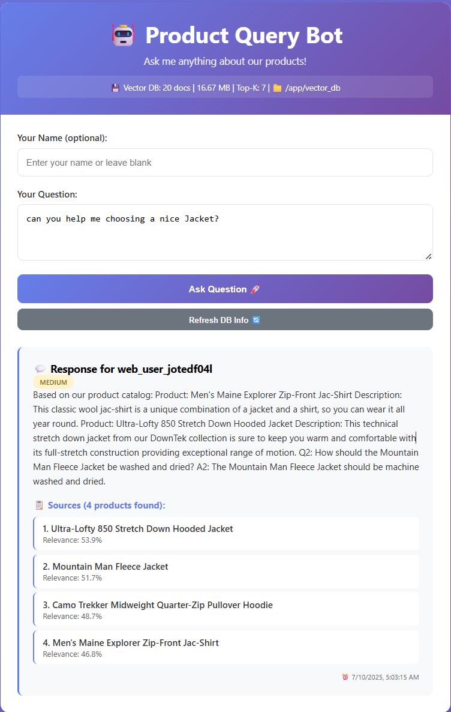

# Product Query Bot 🤖

A Product Query Bot built with RAG (Retrieval-Augmented Generation) pipeline and Multi-Agent Architecture using LangChain, ChromaDB, and FastAPI.

## 🚀 Features

- **RAG Pipeline**: Semantic search with vector embeddings
- **Multi-Agent Architecture**: Retriever and Responder agents using LangGraph
- **REST API**: FastAPI with automatic validation
- **Web Interface**: Interactive chat interface
- **Persistent Storage**: ChromaDB vector database
- **Docker Support**: Full containerization
- **Unit Tests**: Comprehensive test suite

## 🛠️ Tech Stack

- **Backend**: FastAPI, Python 3.11+
- **Vector Database**: ChromaDB
- **Embeddings**: Sentence Transformers (HuggingFace)
- **Multi-Agent**: LangGraph
- **Frontend**: HTML/CSS/JavaScript
- **Containerization**: Docker & Docker Compose
- **Testing**: Pytest

## 📋 Requirements

- Python 3.11+
- Docker & Docker Compose
- 4GB+ RAM
- 2GB+ storage

## 🚀 Quick Start with Docker

## How to use:

### Clone the repository

```bash
  git clone https://github.com/yourusername/product-query-bot.git
  cd product-query-bot
```

### To install requirements
- pip install -r requirements.txt

### To install dev-requirements (for testing)
- pip install -r requirements-dev.txt

### To run the app:
- python app.py

### Run all tests
- python -m pytest test/ -v

### Run with coverage
- python -m pytest test/ --cov=app -v

### To build the Docker:
- docker build -t product-query-bot .

### To run the docker:
- docker-compose up

### Enjoy!


## Sample Image



### 1. Clone the repository
```bash
git clone https://github.com/yourusername/product-query-bot.git
cd product-query-bot

